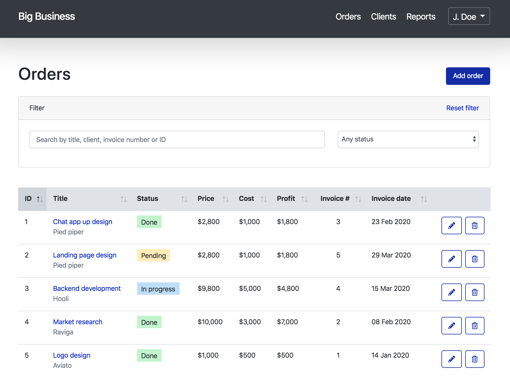

# README

 &nbsp; 

Starter ERP/CRM app built with Ruby on Rails 6. Feel free to use this app for educational purposes, or as a foundation for your next project if you want to take advantage of:

* Ajax datatables

* Bootstrap 4

* Simple Form

* Chartkick

* Devise authentication

* RSpec, Capybara

Demo
----
https://big-business.herokuapp.com/

